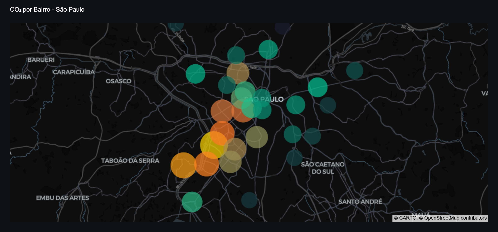
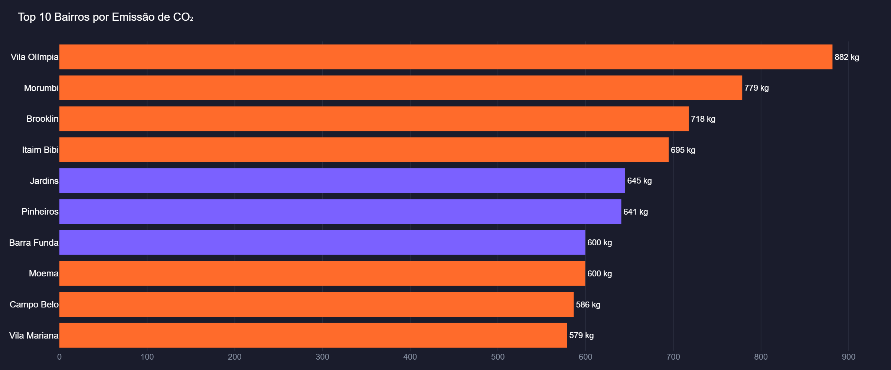
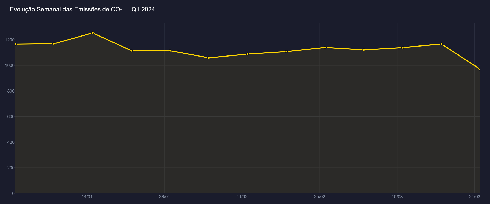
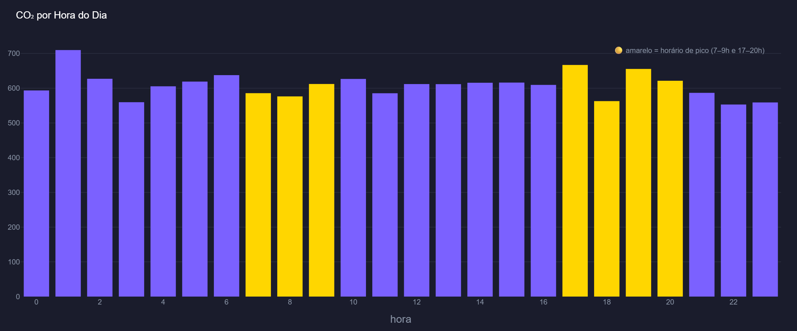
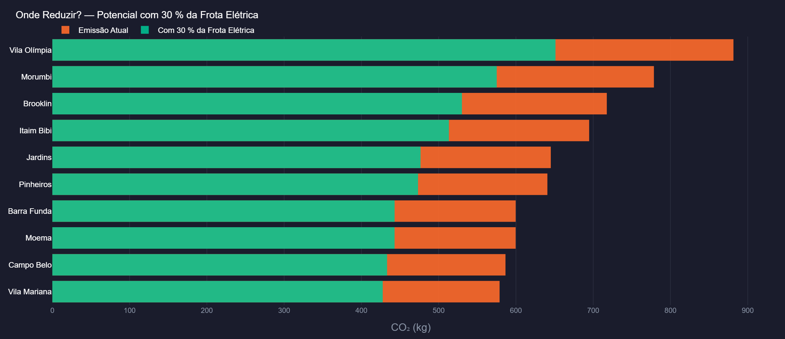

# 🚗 Emissões de CO₂ por Bairro — São Paulo · 99


Dashboard interativo de análise de emissões de CO₂ por corridas de transporte por aplicativo em São Paulo, com foco em identificar **onde é possível reduzir**.

---

## Sobre o Projeto

O transporte por aplicativo é uma das principais fontes de emissão de CO₂ nas grandes cidades brasileiras. Este projeto mapeia as emissões por bairro em São Paulo, identifica os pontos críticos e estima o impacto de uma transição parcial para veículos elétricos.

**Fator de emissão:** 155 g CO₂/km — ICCT Brasil (2023) · dado real  
**Fórmula:** CO₂ (g) = distância (km) × 155 · metodologia CETESB  
**Corridas:** Simuladas com distribuição realista por bairro, horário e tipo de veículo*  
**Stack:** Python · Plotly · SQLite · pandas · Power BI

> *A 99 não disponibiliza dados de corridas publicamente. Este projeto aplica fatores de emissão reais a corridas simuladas para fins de demonstração.*

---

## Screenshots







---

## Visualizações — 8 Gráficos

| # | Gráfico | O que responde |
|---|---------|----------------|
| 1 | Mapa de bolhas | Onde a emissão está concentrada geograficamente? |
| 2 | Top 10 bairros | Quais bairros acumulam mais CO₂? |
| 3 | CO₂ por veículo | Qual categoria emite mais? |
| 4 | CO₂ por zona | Qual região da cidade é mais crítica? |
| 5 | Evolução semanal | Como as emissões variaram no Q1 2024? |
| 6 | CO₂ por hora | Em quais horários a emissão é maior? |
| 7 | Distância × CO₂ | Bairros com viagens longas emitem proporcionalmente mais? |
| 8 | Potencial de redução | Onde focar para reduzir com 30 % da frota elétrica? |

---

## Principais Resultados

- **14,6 ton** de CO₂ emitidas em 10.000 corridas simuladas no Q1 2024
- **Vila Olímpia** e **Morumbi** lideram emissões pela distância média maior das corridas
- A **Zona Sul** concentra o maior volume de emissões absolutas
- Horários de pico (7–9h e 17–20h) respondem por ~40 % das emissões do dia
- Converter **30 % da frota para elétrico** reduziria ~**26 % das emissões** totais
- Corridas com **menos de 5 km** representam alto potencial de substituição modal

---

## Como Executar

```bash
# Instalar dependências
pip install -r requirements.txt

# Gerar os dados simulados + banco SQLite
python generate_data.py

# Gerar todos os gráficos em PNG
python gerar_graficos.py
```

Os gráficos são salvos em `graficos/`.

### Power BI

```bash
python export_powerbi.py
```

Importar cada CSV de `powerbi/export/` via **Obter dados › Texto/CSV**.  
Medidas DAX prontas em `powerbi/medidas_dax.txt` · tema em `powerbi/tema_99.json`.

---

## Estrutura

```
analitcys-co2-bi/
├── graficos/               # 8 gráficos exportados em PNG (2400×1000 px)
├── data/
│   └── bairros.csv         # 30 bairros de SP com coordenadas e peso de demanda
├── sql/
│   ├── schema.sql          # Tabelas + views analíticas (emissões, zona, potencial EV)
│   └── queries.sql         # Queries comentadas: ranking, hora de pico, potencial EV
├── powerbi/
│   ├── medidas_dax.txt     # Medidas DAX prontas para colar no Power BI
│   ├── tema_99.json        # Tema com paleta de cores da 99
│   └── export/             # CSVs prontos para importar no Power BI
├── generate_data.py        # Gerador de dados simulados + banco SQLite
├── export_powerbi.py       # Exporta CSVs para o Power BI
└── requirements.txt
```

---

## 🛠️ Ferramentas Utilizadas

| Categoria | Ferramenta | Uso |
|-----------|------------|-----|
| Linguagem |  | Desenvolvimento completo |
| Visualização |  | Gráficos e mapa · export PNG |
| Dados |  | Manipulação e análise |
| Numérico |  | Simulação e cálculos |
| Banco de dados |  | Armazenamento + views analíticas |
| BI |  | Relatórios e medidas DAX |
| Versionamento |  | Controle de versão |
| Repositório |  | Hospedagem do projeto |

---

*Projeto desenvolvido para portfólio de análise de dados — cenário de mobilidade urbana com fator de emissão real (ICCT Brasil, 2023).*
